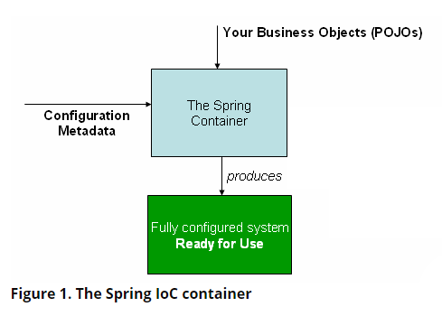

# 1. The IoC Container  
本章主要介绍spring的IOC容器。  
**********
## 1.1. 介绍spring的IOC容器和Beans  
本章介绍了spring的IOC原理。IOC也被称为DI。在此过程中,对象定义他们的属性(也就是，它所需要的其他对象)只有通过构造器的参数,工厂方法的参数,以及从工厂方法返回后在对象实例上设置的属性来定义它们的依赖项。容器创建bean的时候注入这些属性。此过程从根本上讲，是bean本身的逆过程，它通过使用类或服务定位器模式等机制的直接构造来控制依赖项的实例化或位置(这就是控制反转)。  

org.springframework.beans 和 org.springframework.context是spring IOC的基本包。BeanFactory接口提供了一种高级配置机制，能够管理任何类型的对象。  
ApplicationContext是BeanFactory的子接口，它增加了如下特性：  

- 集成了spring的AOP特性；
- 消息资源处理(用于国际化);
- 事件发布;
- 应用程序层特定上下文，例如用于web应用程序的WebApplicationContext。  

简而言之，BeanFactory 提供了框架配置和基本的功能，ApplicationContext 增加了更多企业特性的功能。ApplicationContext 是 BeanFactory 的子类，完整的超集，在这章中，仅仅用于描述spring的IOC容器。使用BeanFactory的更多信息，请参考 ***1.16. The BeanFactory***  
在spring中，被Spring IoC 容器管理的应用程序的对象被称为bean(就是被IOC管理的对象叫做bean),Bean是一个对象被spring的 IOC容器实例化，组装和管理。除此之外，Bean只是应用程序中许多对象之一,容器使用配置元数据(configuration metadata)管理bean之间的依赖关系。  
***********
## 1.2. Container Overview(容器的概览)  
***org.springframework.context.ApplicationContext*** 接口代表了Spring IoC容器，负责实例化，配置和组装Beans。容器通过读取配置元数据（也就是spring的xml配置文件）来得到对象实例化，配置和组装的指令。配置元数据的方式有XML，java注解和java code（应该是javaConfig的方式）。它涵盖了组成你应用程序的对象，以及对象之间丰富的依赖关系。  
Spring提供了ApplicationContext接口的几种实现。在常见应用程序中,ClassPathXmlApplicationContext 或者 FileSystemXmlApplicationContext 是最常用的。尽管XML是定义配置元数据的传统格式，但是通过轻量化的xml去声明使用java注解或者code去配置元数据。  
在大多数应用程序场景中，不需要显式的使用代码来实例化SpringIoC容器的一个或多个实例。例如，在web应用中，在web.xml文件中，简单的8行样板代码通常就足够了(详情参考：1.15.4. Convenient ApplicationContext Instantiation for Web Applications)。如果你使用Eclipse开发工具，你可以轻松的通过点几下鼠标或者键盘就可以创建出样板配置文件了。  
下图显示了Spring工作原理的高级视图。ApplicationContext被创建和初始化之后，应用程序类和配置的元数据被整合，然后，你就获得了可配置或者执行的y应用程序了。  

  
***********
### 1.2.1. Configuration Metadata (配置元数据)  
如上图所示，spring的IOC容器需要一个配置元数据（也就是配置文件）。作为应用程序开发人员，通过这个配置文件来告诉spring容器实例化,配置或者组装你应用程序中的哪些对象。  
传统上，配置元数据以简单直观的XML格式提供，本章中，大多数使用这种方式来解释spring IOC容器的关键概念。  
~~~
注意：xml配置不是唯一的配置元数据的方式。Spring IoC容器本身与实际写入此配置元数据的格式完全解耦。现在许多开发者使用 Java-based configuration （1.12. Java-based Container Configuration）来配置
~~~
更多的配置方式，如下：

- Annotation-based configuration (参考： 1.9. Annotation-based Container Configuration) 2.5版本开始支持  
- Java-based configuration (参考： 1.12. Java-based Container Configuration) 从Spring 3.0开始，Spring JavaConfig项目提供的许多功能成为了Spring核心框架的一部分。因此，您可以使用Java而不是XML文件来为你的应用程序定义benas。使用这些新的特性，请看 @Configuration, @Bean, @Import, 和@DependsOn 注解。

容器管理的配置文件由一个或者多个bean组成，xml形式配置beans，使用\<bean>标签，嵌套在\<beans/>。java配置方式是使用@Bean注解，注释在标有@Configuration的类中。  
定义的这些beans就是你应用程序中实际使用的对象。通常，您定义服务层对象，数据访问对象（DAO），表示对象（例如Struts Action实例），框架对象（例如Hibernate SessionFactories，JMS队列）等等。通常不会在配置文件中配置fine-grained domain objects，因为DAO和业务逻辑通常负责创建和加载域对象。然而，你可以使用Spring与AspectJ的集成，来配置在IoC容器控制之外创建的对象 (参考
5.10.1. Using AspectJ to Dependency Inject Domain Objects with Spring)  
接下来的例子展示了xml配置文件的基本机构  
~~~
<?xml version="1.0" encoding="UTF-8"?>
<beans xmlns="http://www.springframework.org/schema/beans"
    xmlns:xsi="http://www.w3.org/2001/XMLSchema-instance"
    xsi:schemaLocation="http://www.springframework.org/schema/beans
        https://www.springframework.org/schema/beans/spring-beans.xsd">

    <bean id="..." class="...">  ①②
        <!-- collaborators and configuration for this bean go here -->
    </bean>

    <bean id="..." class="...">
        <!-- collaborators and configuration for this bean go here -->
    </bean>

    <!-- more bean definitions go here -->

</beans>
~~~  
① id属性是一个字符串，用于标识单个bean定义；  
② class属性定义具体的bean，使用类的全名(包含包名)；  
id的值指向协作对象。示例的xml没有展示协作对象，更多请参考(1.4.1. Dependency Injection)  
**********
### 1.2.2. Instantiating a Container (实例化容器)  
ApplicationContext 构造函数的资源路径是一种字符串形式，这些资源字符串使容器可以从各种外部资源（例如本地文件系统，Java CLASSPATH等）加载配置元数据，等等。  
~~~
ApplicationContext context = new ClassPathXmlApplicationContext("services.xml", "daos.xml");
~~~  
~~~
注意：学完IOC之后，你可能想了解更多有关Spring的抽象类Resource（参考： Resources），它提供了一种方便的机制，用于从URI中定义的位置读取InputStream。就像2.7.1. Constructing Application Contexts中所描述那样，Resource路径用于构造应用程序的上下文。
~~~  
以下示例显示了服务层对象（services.xml）配置文件：    
~~~
<?xml version="1.0" encoding="UTF-8"?>
<beans xmlns="http://www.springframework.org/schema/beans"
    xmlns:xsi="http://www.w3.org/2001/XMLSchema-instance"
    xsi:schemaLocation="http://www.springframework.org/schema/beans
        https://www.springframework.org/schema/beans/spring-beans.xsd">

    <!-- services -->

    <bean id="petStore" class="org.springframework.samples.jpetstore.services.PetStoreServiceImpl">
        <property name="accountDao" ref="accountDao"/>
        <property name="itemDao" ref="itemDao"/>
        <!-- additional collaborators and configuration for this bean go here -->
    </bean>

    <!-- more bean definitions for services go here -->

</beans>
~~~   
以下示例显示了数据访问对象daos.xml文件：
~~~
<?xml version="1.0" encoding="UTF-8"?>
<beans xmlns="http://www.springframework.org/schema/beans"
    xmlns:xsi="http://www.w3.org/2001/XMLSchema-instance"
    xsi:schemaLocation="http://www.springframework.org/schema/beans
        https://www.springframework.org/schema/beans/spring-beans.xsd">

    <bean id="accountDao"
        class="org.springframework.samples.jpetstore.dao.jpa.JpaAccountDao">
        <!-- additional collaborators and configuration for this bean go here -->
    </bean>

    <bean id="itemDao" class="org.springframework.samples.jpetstore.dao.jpa.JpaItemDao">
        <!-- additional collaborators and configuration for this bean go here -->
    </bean>

    <!-- more bean definitions for data access objects go here -->

</beans>
~~~   
在上面的例子中，服务层由PetStoreServiceImpl类和两个JpaAccountDao和JpaItemDao类型的数据访问对象组成（基于JPA对象关系映射标准）。元素***property name*** 代表javaBean 的属性，元素***ref*** 代表一个bean的定义。id和ref元素之间的这种联系表达了协作对象之间的依赖性。有关配置对象的依存关系的详细信息，请参阅(1.4.1. Dependency Injection)。  
#### 1.2.2.1 Composing XML-based Configuration Metadata  
bean定义可能会跨越多个XML文件，通常，独立的XML配置文件代表代码结构中的逻辑层或模块。  
您可以使用应用程序的构造函数从这些XML文件中加载bean。 如上一节中所示，此构造函数具有多个Resource路径。
或者，使用一个或多个<import />元素从另一个文件中加载bean定义。 以下示例显示了如何执行此操作：  
~~~
<beans>
    <import resource="services.xml"/>
    <import resource="resources/messageSource.xml"/>
    <import resource="/resources/themeSource.xml"/>

    <bean id="bean1" class="..."/>
    <bean id="bean2" class="..."/>
</beans>
~~~  
如上示例，扩展的bean从services.xml, messageSource.xml和 themeSource.xml配置文件中获得。相对于导入文件，所有文件的路劲都是相对的（也就是说导入文件是相对路径，相对于定义导入这个文件比如import.xml），所以services.xml必须和导入文件在同一路径下，然而messageSource.xml和themeSource.xml必须在resources路径下，如您所见，斜杠被忽略。然而，鉴于这些路径是相对的，最好不要使用任何斜线。 根据Spring Schema规定，导入的文件的内容（包括顶级\<beans />元素）必须是有效的XML bean定义。  
~~~
注意：可以但不建议使用相对的“ ../”路径引用父目录中的文件。这样做会造成对当前应用程序外部文件的依赖。特别是，不建议将此应用用于classpath:URLs (例如， classpath:../services.xml),运行时会选择最近的classpath的根目录，然后查看他父级目录。类路径（classpath）配置的更改可能导致选择其他错误的目录。  
你始终可以使用标准资源位置而不是相对路径：例如，file:C:/config/services.xml or classpath:/config/services.xml。但是请注意，您正在将应用程序的配置耦合到特定的绝对位置。通常最好为这样的绝对位置保留一个间接寻址，例如通过在运行时针对JVM系统属性解析的“ $ {…}”占位符。
~~~  
命名空间本身提供了导入指令功能。Further configuration features beyond plain bean definitions are available in a selection of XML namespaces provided by Spring — for example, the context and util namespaces.  
#### 1.2.2.1 The Groovy Bean Definition DSL   
扩展配置元数据的另一个示例，从Grails框架中得知，在Spring’s Groovy Bean Definition DSL ，bean 也能被定义。通常，在“.groovy”文件中进行配置，例如：  
~~~
beans {
    dataSource(BasicDataSource) {
        driverClassName = "org.hsqldb.jdbcDriver"
        url = "jdbc:hsqldb:mem:grailsDB"
        username = "sa"
        password = ""
        settings = [mynew:"setting"]
    }
    sessionFactory(SessionFactory) {
        dataSource = dataSource
    }
    myService(MyService) {
        nestedBean = { AnotherBean bean ->
            dataSource = dataSource
        }
    }
}
~~~  
这种配置样式在很大程度上等同于XML bean定义，甚至支持Spring的XML配置名称空间。 它还允许通过importBeans指令导入XML文件。  
************  
### 1.2.3. Using the Container(使用容器)  
ApplicationContext 是一个接口，能够管理不同bean的注册以及管理他们。通过使用***T getBean(String name, Class<T> requiredType)*** 这个方法，你可以实例化你的bean。  
ApplicationContext 可以让你读取bean definitions 并且访问他们，如下例子：  
~~~
// create and configure beans
ApplicationContext context = new ClassPathXmlApplicationContext("services.xml", "daos.xml");

// retrieve configured instance
PetStoreService service = context.getBean("petStore", PetStoreService.class);

// use configured instance
List<String> userList = service.getUsernameList();
~~~  
使用Groovy配置，使用起来非常相似。 它有一个不同的实现类，该类可识别Groovy（但也了解XML Bean定义）。 以下示例显示了Groovy配置：  
~~~
ApplicationContext context = new GenericGroovyApplicationContext("services.groovy", "daos.groovy");
~~~  
最灵活的使用是GenericApplicationContext与读取器委托结合使用，例如，与XML文件的XmlBeanDefinitionReader结合使用，如以下示例所示：  
~~~
GenericApplicationContext context = new GenericApplicationContext();
new XmlBeanDefinitionReader(context).loadBeanDefinitions("services.xml", "daos.xml");
context.refresh();
~~~  
也可以使用GroovyBeanDefinitionReader 解析Groovy文件，例如：  
~~~
GenericApplicationContext context = new GenericApplicationContext();
new GroovyBeanDefinitionReader(context).loadBeanDefinitions("services.groovy", "daos.groovy");
context.refresh();
~~~    
在同一ApplicationContext上混合和匹配此类阅读器委托，从不同的配置源读取Bean定义。  
你可以使用getBean来获取bean的实例。ApplicationContext 几口有几种不同获取bean的方法，但是，理想情况下，您的应用程序代码永远不要使用它们。实际上，您的应用程序代码不应该调用getBean（）方法，因此就不会依赖于Spring API。例如，Spring整合了Web框架提供了依赖注入给不同web框架组件，例如controllers 和JSF-managed Bean），使您可以通过元数据（例如自动装配注释）声明对特定Bean的依赖项。  
*************  
## 1.3. Bean Overview(bean 总览)  
IOC容器可以管理很多benas，提供给容器的这些beans被元数据(也就是配置文件)所创建(例如，例如，以XML\<bean/>定义的形式)  
在容器内，这些被定义的bean为BeanDefinition对象，其中包含（除其他信息外）以下元数据：  
- 包的全名：通常，定义了Bean的实际实现类。  
- Bean行为配置元素，用于声明Bean在容器中的行为（作用域，生命周期回调等）。
- 对其它bean的引用，称为协作者或依赖项。
- 要在新创建的对象中设置的其他配置项，例如，池的大小限制或要在管理连接池的bean中使用的连接数。    

这些元数据转换为构成每个bean的属性。 下表描述了这些属性：  
Property | Explained in…​ | 对应章节
---|---|---|
Class | Instantiating Beans |1.3.2. Instantiating Beans
Name | 	Naming Beans |1.3.1. Naming Beans
Scope| Bean Scopes |1.5. Bean Scopes
Constructor arguments| Dependency Injection|1.4.1. Dependency Injection
Properties|Dependency Injection|1.4.1. Dependency Injection
Autowiring mode | Autowiring Collaborators|1.4.5. Autowiring Collaborators
Lazy initialization mode|Lazy-initialized Beans|1.4.4. Lazy-initialized Beans
Initialization method|Initialization Callbacks|1.6.1.1.Initialization Callbacks
Destruction method|Destruction Callbacks|1.6.1.2.Destruction Callbacks  

除了包含如何创建特定Bean的信息之外，ApplicationContext实现还允许将外部创建的对象交给spring管理。通过getBeanFactory() 方法从 ApplicationContextd的BeanFactory中返回默认实现类DefaultListableBeanFactory。DefaultListableBeanFactory 提供了registerSingleton(..) 和 registerBeanDefinition(..) 方法。然而，一般的应用程序还是通过元数据方式定义一个bean。  
~~~
注意：尽早的注册bean和手工提供的单例实例,以便容器在自动装配和其检查步骤中正确地推理它们。虽然在某种程度上支持覆盖现有元数据和现有单例实例，但官方不支持正在运行时（与对工厂的实时访问同时）对新bean的注册，并且可能导致并发访问异常，bean容器中的状态不一致或者二者都有。
~~~  
### 1.3.1. Naming Beans(命名beans)  
每个bean具有一个或多个标识符。 这些标识符在Bean的容器内必须是唯一的。bean通常只有一个标识符。 但是，如果需要多个，可以将扩展的名称视为别名。
  
在基本的xml配置文件中，你可以使用id属性或者name属性，或者同时使用两者来作为bean的标识。id属性可让您精确指定一个id。 通常，这些名称是字母数字（“ myBean”，“ someService”等），但它们也可以包含特殊字符。如果要为bean引入其他别名，还可以在name属性中指定它们，并用逗号（，），分号（;）或空格分隔。作为历史记录，在Spring 3.1之前的版本中，id属性定义为xsd：ID类型，该类型限制了可能的字符。 从3.1开始，它被定义为xsd：string类型。 请注意，Bean的ID唯一性仍由容器强制执行，尽管不再由XML解析器执行。  
你不需要为bean提供一个id或者name，如果你没提供id或者name，容器会为该bean生成一个唯一的名字。但是如果你想要通过name引用该bean，，则必须使用ref元素或a Service Locator style lookup，您必须提供一个name。 不提供name的动机与使用inner beans 和 autowiring 有关。
~~~
                            bean名称的约定  
当给bean命名的时候，遵循java规范。也就是，首字母小写并且采用驼峰形式。例如:accountManager,accountService,userDao,loginController等。
命名规范使你的配置文件简单且容易理解。另外，如果您使用Spring AOP,通过名字相关的一组应用起来将会方便很多。
~~~
~~~
注意：通过在类路径中进行组件扫描，Spring会按照前面描述的规则为未命名的组件生成Bean名称：本质上，是采用类名称并将其首字母转换为小写。但是，在特殊情况下，如果有多个字母并且第一个和第二个字母均为大写字母，则会保留原始大小写。 这些规则与java.beans.Introspector.decapitalize（Spring在此使用）定义的规则相同。
~~~  
#### 1.3.1.1. Aliasing a Bean outside the Bean Definition(别名)  
在bean定义本身中，可以使用由id属性指定的一个名称和name属性中任意数量的其他名称的组合来为bean提供多个名称。 这些名称可以是同一个bean的等效别名，并且在某些情况下很有用，例如通过使用该组件本身的bean名称，让应用程序中的每个组件都引用一个公共依赖项。  
但是，在实际定义bean的地方指定所有别名并不总是充足的。 有时需要为在别处定义的bean引入别名。 这在大型系统中通常是这种情况，在大型系统中，配置文件分配在每个子系统之间，每个子系统都有自己的对象定义集。 在基于XML配置元数据中，可以使用\<alias />元素来完成此操作。 以下示例显示了如何执行此操作：
~~~
<alias name="fromName" alias="toName"/>
~~~  
在这种情况下，在使用该别名定义之后，也可以将名为fromName的bean（在同一容器中）称为toName。  
例如：子系统A通过名称subsystemA-dataSource指定数据源。子系统B通过名称subsystemB-dataSource指定数据源。当主系统需要用到这两个子系统,主系统通过myApp-dataSource指定数据源。要使三个名称都引用相同的对象，可以将以下别名定义添加到配置文件中：  
~~~
<alias name="myApp-dataSource" alias="subsystemA-dataSource"/>
<alias name="myApp-dataSource" alias="subsystemB-dataSource"/>
~~~  
现在，每个组件和主应用程序都可以通过唯一的名称引用数据源，并保证不与任何其他定义冲突（有效地创建命名空间），但它们引用的是同一bean。  
~~~
                        Java-configuration
如果你使用Javaconfiguration，通过@Bean提供别名。具体参考：1.12.3. 1.Declaring a Bean
~~~  
### 1.3.2. Instantiating Beans(实例化)  
bean可以创建不止一个对象。 当被询问时，容器通过bean的名字查找，并通过配置文件使用该bean创建（或获取）实际对象。  
如果是基于xml的配置文件，在\<bean/>的标签中class属性指定了你要实例化对象的类型。class属性(在内部是BeanDefinition实例的一个Class属性)通常是必须的。（有关异常，请参见1.3.2.3Instantiation by Using an Instance Factory Method和1.7. Bean Definition Inheritance。）可以通过以下两种方式之一使用Class属性： 

- 通常，容器指定要构造的Bean类，然后通过反射调用其构造函数直接创建Bean，这在某种程度上等同于java使用new 产生的实例。  
- 指定的实际类是包含一个静态工厂方法的，该方法被调用来创建对象，少数情况下容器通过调用一个类的静态工厂方法来创建bean。通过调用静态工厂方法返回的对象的类型可能是相同的class或者完全不同的class（这段不太理解？）  
~~~
内部类的命名：
如果要为静态内部类配置Bean定义，则必须使用内部类的二进制名称。  
例如，在com.example包中有一个SomeThing类，在类SomeThing中有一个static的内部类OtherThing，class属性的值应该配置成com.example.SomeThing$OtherThing。  
$字符来区分内部类和外部类。
~~~  
#### 1.3.2.1.Instantiation with a Constructor （通过构造函数实例化一个）  
当用构造方法来创建bean，所有普通类都可以被Spring使用并兼容。也就是说，正在开发的类不需要实现任何特定的接口或以特定的方式进行编码（就是不用提供任何方法，例如setter方法）。只需指定bean类就足够了。 但是，根据特定bean使用的IoC的类型，您可能需要一个默认（空）构造函数。  
IOC容器可以管理任何你想要它管理的类。 它不仅限于管理真正的JavaBean。大多数Spring用户更喜欢实际的（真是存在的）JavaBean，它们仅具有默认（无参数）构造函数，并且根据容器中的属性适当的提供setter和getter方法。您还可以在容器中配置更多奇特的非bean样式类。例如，如果您需要使用不符合JavaBean规范的遗留的连接池，Spring也可以对其进行管理。  
通过xml配置文件，你可以指定bean像如下的方式：
~~~
<bean id="exampleBean" class="examples.ExampleBean"/>

<bean name="anotherExample" class="examples.ExampleBeanTwo"/>
~~~  
有关向构造函数提供参数（如果需要）并且在构造对象之后设置对象实例属性的方法，参考：1.4.1. Dependency Injection  
#### 1.3.2.2.Instantiation with a Static Factory Method（通过静态工厂实例化）  
当使用静态工厂方法去创建一个bean，class属性代表class所属类，这个类里提供了静态工厂方法，并用factory-method来指定这个方法。您应该能够调用此方法（带有可选参数，如后面所述），并返回一个对象，该对象其实是通过构造函数创建。 这种bean定义的方式被称为静态工厂方法。  
下面的例子说明了通过静态工厂方法创建bean的方式。这种定义方式不指定返回对象的类型（类），而仅指定包含的工厂方法。在这个例子中createInstance() 方式必须是静态的。请参考下面的例子：  
~~~
<bean id="clientService"
    class="examples.ClientService"
    factory-method="createInstance"/>
~~~  
根据上面的bean定义，下面的代码展示了如何使用：
~~~
public class ClientService {
    private static ClientService clientService = new ClientService();
    private ClientService() {}

    public static ClientService createInstance() {
        return clientService;
    }
}
~~~  
有关为工厂方法提供（可选）参数并在工厂返回对象后设置对象实例属性方法的详细信息，请参考：1.4.2. Dependencies and Configuration in Detail  
#### 1.3.2.3. Instantiation by Using an Instance Factory Method (通过实例方法来初始化)  
类似通过静态工厂方法实例化，通过实例化工厂调用非静态方法实例化一个bean。使用此方法，请将class属性保留为空，并用factory-bean属性指定bean（or parent or ancestor）的名称，该bean包含要创建对象的实例方法的。通过factory-method属性设置要调用的工厂方法。下面的例子展示如何配置该bean：  
~~~
<!-- the factory bean, which contains a method called createClientServiceInstance() -->
<bean id="serviceLocator" class="examples.DefaultServiceLocator">
    <!-- inject any dependencies required by this locator bean -->
</bean>

<!-- the bean to be created via the factory bean -->
<bean id="clientService"
    factory-bean="serviceLocator"
    factory-method="createClientServiceInstance"/>
~~~  
下面的例子展示了相应的类  
~~~
public class DefaultServiceLocator {

    private static ClientService clientService = new ClientServiceImpl();

    public ClientService createClientServiceInstance() {
        return clientService;
    }
}
~~~  
一个工厂类可以包含不止一个工厂方法，如下：  
~~~
<bean id="serviceLocator" class="examples.DefaultServiceLocator">
    <!-- inject any dependencies required by this locator bean -->
</bean>

<bean id="clientService"
    factory-bean="serviceLocator"
    factory-method="createClientServiceInstance"/>

<bean id="accountService"
    factory-bean="serviceLocator"
    factory-method="createAccountServiceInstance"/>
~~~  
对应的类文件：  
~~~
public class DefaultServiceLocator {

    private static ClientService clientService = new ClientServiceImpl();

    private static AccountService accountService = new AccountServiceImpl();

    public ClientService createClientServiceInstance() {
        return clientService;
    }

    public AccountService createAccountServiceInstance() {
        return accountService;
    }
}
~~~  
这种方法表明，工厂Bean本身可以通过依赖项注入（DI）进行管理和配置。详细请参考：1.4.2. Dependencies and Configuration in Detail  
~~~
注意：在Spring文档中，“ factory bean”是指在Spring容器中配置并通过实例或静态工厂方法创建对象的bean。相比之下，FactoryBean（请注意大小写）是指特定的Spring的实现类。
~~~  
#### 1.3.2.4. Determining a Bean’s Runtime Type(推断bean的运行时类型)  
推断特定bean的运行时类型并非易事。Bean元数据定义的类只是初始类引用，可能与声明的工厂方法或者是FactoryBean结合使用，这可能导致Bean的运行时类型不同，或者通过实例工厂方法下完全不进行设置（通过指定的factory-bean名称解析）。此外，AOP代理可以使用基于接口的代理包装bean实例，而目标Bean的实际类型（仅是其实现的接口）的暴露程度有限。***（这段很不理解，以后理解了回来进一步说明）***  
推断特定bean的实际运行时类型的推荐方法是对指定bean名称的调用BeanFactory.getType方法。 这考虑了以上所有情况，并返回了通过调用BeanFactory.getBean将针对同一bean名称返回的对象类型。（不理解）  
## 1.4. Dependencies(依赖关系)  
典型的企业级应用程序不包含单个对象（或Spring中所说的bean）。即使是最简单的应用程序，也有一些对象可以协同工作，以呈现最终用户视为一致的应用程序。下一部分将说明如何从定义多个独立的Bean到实现对象协作来实现目标应用程序。  
### 1.4.1. Dependency Injection（依赖注入）  
依赖注入(DI)是一个过程，对象定义他们的依赖（也就是，该对象工作所需要的）只是通过构造函数的参数，工厂方法的参数，或者属性被注入到对象实例，在该对象被构造或者从一个工厂方法返回（翻译的不好，大概的意思就是通过构造函数，工厂方法和属性注入来实现DI的）。当容器创建bean的后，它注入这些依赖。此过程从根本上讲是bean本身通过使用类的构造方法来控制自己的实例化或者定位依赖的位置（因此叫做IOC）  
使用DI原理，代码更加简洁，当为对象提供依赖项时，解耦会更有效。该对象不查找其依赖项，并且不知道依赖项或类的位置。结果，您的类变得更易于测试，尤其是当依赖项依赖于接口或抽象基类时，它们允许在单元测试中使用存根或模拟实现。  
DI主要是2中形式：Constructor-based dependency injection 和Setter-based dependency injection。  
#### 1.4.1.1. Constructor-based Dependency Injection(构造函数)  
基于构造函数的DI是容器通过调用包含多个参数的构造函数来完成的，每个参数表示一个依赖项。这等同于调用带有特定参数的静态工厂方法来构造Bean，并且本次讨论也将构造函数和静态工厂方法的参数视为类似。 以下示例显示了只通过构造函数来进行依赖项的注入：  
~~~
public class SimpleMovieLister {

    // the SimpleMovieLister has a dependency on a MovieFinder
    private MovieFinder movieFinder;

    // a constructor so that the Spring container can inject a MovieFinder
    public SimpleMovieLister(MovieFinder movieFinder) {
        this.movieFinder = movieFinder;
    }

    // business logic that actually uses the injected MovieFinder is omitted...
}
~~~  
注意，该类没有什么特别的。 它是一个POJO，不依赖于容器特定的接口，基类或注释。  
#### 1.4.1.2. Constructor Argument Resolution(构造函数参数解析)  
当使用参数的时候，构造函数参数被解析。如果bean的构造函数参数不存在歧义，构造函数参数的顺序就是实例化bean时提供给构造器的顺序。考虑下下面的例子：  
~~~
package x.y;

public class ThingOne {

    public ThingOne(ThingTwo thingTwo, ThingThree thingThree) {
        // ...
    }
}
~~~  
假设ThingTwo和ThingThree类没有通过继承关联，并且不存在歧义。因此，以下配置可以正常工作，并且您无需在\<constructor-arg />元素中显式指定构造函数参数索引或类型。  
~~~
<beans>
    <bean id="beanOne" class="x.y.ThingOne">
        <constructor-arg ref="beanTwo"/>
        <constructor-arg ref="beanThree"/>
    </bean>

    <bean id="beanTwo" class="x.y.ThingTwo"/>

    <bean id="beanThree" class="x.y.ThingThree"/>
</beans>
~~~  
当引用另一个bean时，类型是已知的，并且可以发生匹配（与前面的示例一样）。 当使用简单类型（例如\<value> true </ value>）时，Spring无法确定值的类型，因此在没有帮助的情况下无法按类型进行匹配。 考虑以下类别：  
~~~
package examples;

public class ExampleBean {

    // Number of years to calculate the Ultimate Answer
    private int years;

    // The Answer to Life, the Universe, and Everything
    private String ultimateAnswer;

    public ExampleBean(int years, String ultimateAnswer) {
        this.years = years;
        this.ultimateAnswer = ultimateAnswer;
    }
}
~~~
***1、Constructor argument type matching***  
在上述情况下，如果您通过使用type属性明确指定构造函数参数的类型，则容器可以使用简单类型进行匹配。 如以下示例所示：  
~~~
<bean id="exampleBean" class="examples.ExampleBean">
    <constructor-arg type="int" value="7500000"/>
    <constructor-arg type="java.lang.String" value="42"/>
</bean>
~~~  
***2、Constructor argument index***  
您可以使用index属性来显式指定构造函数参数的索引，如以下示例所示：  
~~~
<bean id="exampleBean" class="examples.ExampleBean">
    <constructor-arg index="0" value="7500000"/>
    <constructor-arg index="1" value="42"/>
</bean>
~~~  
除了解决多个简单值的歧义之外，指定索引还可以解决构造函数具有两个相同类型的参数引起的歧义。  
~~~
注意：索引从0开始。
~~~  
***3、Constructor argument name***  
还可以使用构造函数参数名称来消除歧义，如以下示例所示：  
~~~
<bean id="exampleBean" class="examples.ExampleBean">
    <constructor-arg name="years" value="7500000"/>
    <constructor-arg name="ultimateAnswer" value="42"/>
</bean>
~~~  
请记住，要立即使用该功能，必须在启用调试标志的情况下编译代码，以便Spring可以从构造函数中查找参数名称。如果您不能或不想使用debug标志编译代码，则可以使用@ConstructorProperties JDK注释显式命名构造函数参数。 然后，样本类必须如下所示：  
~~~
package examples;

public class ExampleBean {

    // Fields omitted

    @ConstructorProperties({"years", "ultimateAnswer"})
    public ExampleBean(int years, String ultimateAnswer) {
        this.years = years;
        this.ultimateAnswer = ultimateAnswer;
    }
}
~~~  
### 1.4.1.2. Setter-based Dependency Injection (基于setter的依赖注入)  
通过调用无参数构造函数或无参数静态工厂方法来实例化bean之后，容器通过在bean上调用setter方法来完成DI。  
下面的例子展示了，一个class只能被DI通过setter方法。这个class是个常规的java类。它是一个POJO，不依赖于容器特定的接口，基类或注释。  
~~~
public class SimpleMovieLister {

    // the SimpleMovieLister has a dependency on the MovieFinder
    private MovieFinder movieFinder;

    // a setter method so that the Spring container can inject a MovieFinder
    public void setMovieFinder(MovieFinder movieFinder) {
        this.movieFinder = movieFinder;
    }

    // business logic that actually uses the injected MovieFinder is omitted...
}
~~~  
ApplicationContext 支持***构造器注入和setter方法注入*** 。在通过构造函数方法注入了某些依赖项之后，它还支持基于setter的DI(也就是说2种方法可以混用)。您以BeanDefinition的形式配置依赖项，将其与PropertyEditor实例结合使用，以将属性从一种格式转换为另一种格式。但是，大多数Spring用户并不直接（即以编程方式）使用这些类，而是使用XML定义bean，带注解的组件（即以@ Component，@ Controller等进行注释的类）或基于Java的@Configuration类@Bean方法来工作的。然后将这些源在内部转换为BeanDefinition的实例，并用于加载整个Spring IoC容器实例。  
~~~
        Constructor-based or setter-based DI?
由于您可以混合使用基于构造函数的DI和基于setter的DI，因此将构造函数用于强制性依赖项并将setter方法或配置方法用于可选依赖性是一个很好的经验法则。请注意，可以在setter方法上使用@Required注解，以使该属性成为必需的依赖项。 但是，最好使用带有参数构造函数注入。
Spring团队通常提倡构造函数注入，因为它可以让您将应用程序组件实现为不可变的对象，并确保所需的依赖项不为null。此外，构造函数注入的组件始终以完全初始化的状态返回到客户端（调用）代码。附带说明一下，构造函数带有大量的参数是一种不好的，这表明该类可能承担了太多的职责，应将其重构以更好地解决关注点分离问题。
Setter注入主要应用于在类中可分配合理的默认值的可选依赖项。否则，必须在使用注入对象的时候进行非空检查。setter注入的一个好处是，setter方法可使该类的对象在以后重新配置或重新注入。 因此，通过JMX MBean进行管理是用于setter注入的引人注目的用例。
为class使用最适合的DI。 有时，在处理您没有源代码的第三方类时，将为您做出选择。 例如，如果第三方类未公开任何setter方法，则构造函数注入可能是DI的唯一可用形式。
~~~  
#### 1.4.1.3. Dependency Resolution Process(依赖的解析过程)  
容器对bean依赖项进行解析，如下步骤所示：  

- ApplicationContext 被创建并且初始化配置文件中配置的所有bean。可以通过XML，java code 和注解来进行配置。  
- 对于每个bean，其依赖关系都以属性，构造函数参数或static-factory方法的参数的形式表示（如果使用它替代构造函数）。 当创建Bean时，会将这些依赖项提供给Bean。  
- 每个属性或构造函数参数都是要设置值的实际定义，或者是对容器中另一个bean的引用。  
- 每个值的属性或构造函数参数都将从其指定的格式转换为该属性或构造函数参数的实际类型。 默认情况下，Spring可以将以字符串格式提供的值转换为所有内置类型，例如int，long，String，boolean等。  

在创建容器时，Spring容器会验证每个bean的配置。但是，在实际创建Bean之前，不会设置Bean的属性值。创建容器时，将创建具有单例作用域并设置为预先实例化（默认）的Bean。作用域被定义在1.5. Bean Scopes。否则，只有bean被需要的时候，才会被实例化。创建和分配Bean的依赖关系及其依赖关系的依赖关系（依此类推）时，可能会导致创建出一个Bean图。请注意，这些依赖项之间的不匹配可能会在后期出现-即在首次创建受影响的bean时。  
~~~
            Circular dependencies(循环依赖)
如果主要使用构造函数注入，则可能会产生无法解决的循环依赖问你题。
例如：通过构造函数注入时，A类需要一个B的实例，并且B类也需要一个A类的实例。如果您配置了将类A和B相互注入的bean，则Spring IoC容器会在运行时检测到此循环引用，并抛出BeanCurrentlyInCreationException异常。
一种可能的解决方案是编辑某些类的源代码，将通过构造函数的配置方式改成setter注入方式。或者，避免构造函数注入，而仅使用setter注入。换句话说，尽管不建议这样做，但是您可以使用setter注入配置循环依赖项。与典型情况（没有循环依赖关系）不同，循环依赖的问题在于bean A和bean B在完成实例化之前谁先被注入(类似于先有鸡还是先有蛋的问题)。
~~~  
通常，您可以相信Spring做正确的事。它在容器加载时检测配置问题，例如对不存在Bean的引用和循环依赖问题。在实际创建bean时，Spring设置属性并尽可能晚地解决依赖关系。这意味着如果创建对象或其依赖项之一存在问题，在正确加载了Spring的容器以后可以在您请求对象时生成异常-例如，由于缺少属性或存在无效属性。这可能会延迟某些配置问题的可见性，这就是为什么默认情况下ApplicationContext实现会预先实例化单例bean的原因。在实际需要使用这些bean之前要花一些时间和内存，您会在创建ApplicationContext时发现配置问题，而不是以后。您仍然可以覆盖此默认行为，以便单例bean延迟初始化，而不是预先实例化。  
如果不存在循环依赖关系，则在将一个或多个协作bean注入到依赖bean中时，每个协作bean都将在注入到依赖bean中之前被完全配置。这意味着，如果bean A依赖于bean B，则Spring IoC容器会在调用bean A的setter方法之前完全配置bean B。换句话说，实例化该Bean（如果它不是预先实例化的单例），设置其依赖关系，并调用相关的生命周期方法（例如配置的init方法（Initialization Callbacks）或InitializingBean回调方法（ InitializingBean callback method））。  
#### 1.4.1.4. Examples of Dependency Injection(DI的例子)  
下面的例子使用xml配置文件通过setter方法DI。Spring XML配置文件的一小部分指定了一些bean定义，如下所示：  
~~~
<bean id="exampleBean" class="examples.ExampleBean">
    <!-- setter injection using the nested ref element -->
    <property name="beanOne">
        <ref bean="anotherExampleBean"/>
    </property>

    <!-- setter injection using the neater ref attribute -->
    <property name="beanTwo" ref="yetAnotherBean"/>
    <property name="integerProperty" value="1"/>
</bean>

<bean id="anotherExampleBean" class="examples.AnotherBean"/>
<bean id="yetAnotherBean" class="examples.YetAnotherBean"/>
~~~  
以下示例显示了相应的ExampleBean类：  
~~~
public class ExampleBean {

    private AnotherBean beanOne;

    private YetAnotherBean beanTwo;

    private int i;

    public void setBeanOne(AnotherBean beanOne) {
        this.beanOne = beanOne;
    }

    public void setBeanTwo(YetAnotherBean beanTwo) {
        this.beanTwo = beanTwo;
    }

    public void setIntegerProperty(int i) {
        this.i = i;
    }
}
~~~  
在前面的示例中，声明了setter以与XML文件中指定的属性匹配。 以下示例使用基于构造函数的DI：  
~~~
<bean id="exampleBean" class="examples.ExampleBean">
    <!-- constructor injection using the nested ref element -->
    <constructor-arg>
        <ref bean="anotherExampleBean"/>
    </constructor-arg>

    <!-- constructor injection using the neater ref attribute -->
    <constructor-arg ref="yetAnotherBean"/>

    <constructor-arg type="int" value="1"/>
</bean>

<bean id="anotherExampleBean" class="examples.AnotherBean"/>
<bean id="yetAnotherBean" class="examples.YetAnotherBean"/>
~~~  
以下示例显示了相应的ExampleBean类：   
~~~
public class ExampleBean {

    private AnotherBean beanOne;

    private YetAnotherBean beanTwo;

    private int i;

    public ExampleBean(
        AnotherBean anotherBean, YetAnotherBean yetAnotherBean, int i) {
        this.beanOne = anotherBean;
        this.beanTwo = yetAnotherBean;
        this.i = i;
    }
}
~~~  
bean定义中指定的构造函数参数用作ExampleBean构造函数的参数。  
现在考虑该示例的一个变体，在该变体中，不是使用构造函数，而是指示Spring调用静态工厂方法以返回对象的实例：  
~~~
<bean id="exampleBean" class="examples.ExampleBean" factory-method="createInstance">
    <constructor-arg ref="anotherExampleBean"/>
    <constructor-arg ref="yetAnotherBean"/>
    <constructor-arg value="1"/>
</bean>

<bean id="anotherExampleBean" class="examples.AnotherBean"/>
<bean id="yetAnotherBean" class="examples.YetAnotherBean"/>
~~~  
以下示例显示了相应的ExampleBean类：   
~~~
public class ExampleBean {

    // a private constructor
    private ExampleBean(...) {
        ...
    }

    // a static factory method; the arguments to this method can be
    // considered the dependencies of the bean that is returned,
    // regardless of how those arguments are actually used.
    public static ExampleBean createInstance (
        AnotherBean anotherBean, YetAnotherBean yetAnotherBean, int i) {

        ExampleBean eb = new ExampleBean (...);
        // some other operations...
        return eb;
    }
}
~~~  
静态工厂方法的参数由\<constructor-arg />元素提供，与实际使用构造函数时完全相同。factory方法返回的类的类型不必与包含静态工厂方法的类的类型相同(尽管在此示例中是)。实例（非静态）工厂方法可以以基本上相同的方式使用（除了使用factory-bean属性代替class属性之外），因此在此不讨论这些细节。  
### 1.4.2. Dependencies and Configuration in Detail(依赖和配置详情)  
如上一节所述，您可以将Bean属性和构造函数参数定义为对其他Bean的依赖。Spring的基于XML的配置为此目的提供了\<property />和\<constructor-arg />标签。  
#### 1.4.2.1. Straight Values (Primitives, Strings, and so on)  
\<property />标签的value属性将属性或构造函数参数指定为人类可读的字符串表示形式。 Spring的转换服务（3.4.4. The ConversionService API）用于将这些值从字符串转换为属性或参数的实际类型。 以下示例显示了设置的各种值：  
~~~
<bean id="myDataSource" class="org.apache.commons.dbcp.BasicDataSource" destroy-method="close">
    <!-- results in a setDriverClassName(String) call -->
    <property name="driverClassName" value="com.mysql.jdbc.Driver"/>
    <property name="url" value="jdbc:mysql://localhost:3306/mydb"/>
    <property name="username" value="root"/>
    <property name="password" value="masterkaoli"/>
</bean>
~~~  
下面的示例使用p-namespace进行更简洁的XML配置：  
~~~
<beans xmlns="http://www.springframework.org/schema/beans"
    xmlns:xsi="http://www.w3.org/2001/XMLSchema-instance"
    xmlns:p="http://www.springframework.org/schema/p"
    xsi:schemaLocation="http://www.springframework.org/schema/beans
    https://www.springframework.org/schema/beans/spring-beans.xsd">

    <bean id="myDataSource" class="org.apache.commons.dbcp.BasicDataSource"
        destroy-method="close"
        p:driverClassName="com.mysql.jdbc.Driver"
        p:url="jdbc:mysql://localhost:3306/mydb"
        p:username="root"
        p:password="masterkaoli"/>

</beans>
~~~  
前面的XML更简洁。但是错误的被发现是在运行时，而不是设计时，除非你使用IDE（例如，IDEA或者 Spring Tools for Eclipse），它可以帮助你在创建bean之后，自动完成校验。所以强烈建议使用IDE。　　
你也可以配置java.util.Properties实例,如下:  
~~~
<bean id="mappings"
    class="org.springframework.context.support.PropertySourcesPlaceholderConfigurer">

    <!-- typed as a java.util.Properties -->
    <property name="properties">
        <value>
            jdbc.driver.className=com.mysql.jdbc.Driver
            jdbc.url=jdbc:mysql://localhost:3306/mydb
        </value>
    </property>
</bean>
~~~  
Spring容器通过使用JavaBeans的PropertyEditor机制将\<value />元素内的文本转换为java.util.Properties实例。这是一个很好的快捷方式，并且是Spring团队偏爱使用的几个地方之一。 值属性样式上的嵌套\<value />元素。  
##### 1.4.2.1.1 The idref element  
idref元素只是一种防错方法，可以将容器中另一个bean的id（字符串值-不是引用）传递给\<constructor-arg />或\<property />元素。 以下示例显示了如何使用它：  
~~~
<bean id="theTargetBean" class="..."/>

<bean id="theClientBean" class="...">
    <property name="targetName">
        <idref bean="theTargetBean"/>
    </property>
</bean>
~~~  
前面的bean定义片段（在运行时）与下面的片段完全等效：  
~~~
<bean id="theTargetBean" class="..." />

<bean id="client" class="...">
    <property name="targetName" value="theTargetBean"/>
</bean>
~~~  
第一种形式优于第二种形式，因为使用idref标记可使容器在部署时验证所引用Bean实际上是否存在。在第二个形式中，不对传递到客户端的bean的targetName属性值执行验证。 拼写错误仅在实际实例化客户端bean时才发现（可能会导致致命的结果）。 如果客户Bean是原型Bean，则可能在部署容器很久之后才发现此错字和所产生的异常。  
~~~
注意:在4.0 Bean XSD中不再支持idref元素上的local属性，因为它不再提供常规Bean引用上的值。 升级到4.0模式时，将现有的idref本地引用更改为idref bean。
~~~  
\<idref />元素一个常用的地方（至少在Spring 2.0之前的版本中）是在ProxyFactoryBean的bean中定义的AOP拦截器（6.4.1. Basics）的配置，指定拦截器名称时使用/<idref />元素可防止您拼写错误的拦截器ID。  
#### 1.4.2.1. References to Other Beans (Collaborators)[依赖其他的bean]  
ref元素是\<constructor-arg />或\<property />定义元素内的最后一个元素。在这里，ref可以指定依赖的属性或者对象。引用的bean是要设置其属性的bean的依赖关系，并且在设置属性之前根据需要对其进行初始化。（如果协作者是单例bean，则它可能已经由容器初始化了。）所有引用最终都是对另一个对象的引用。通过bean或者parent属性进行作用域和验证取决于您是指定另一个对象的ID或名称。（翻译的乱七八糟）  
通过\<ref />标记的bean属性指定目标bean是最通用的形式，并且允许创建对同一容器或父容器中任何bean的引用，而不管它是否在同一XML文件中。bean属性的值可以与目标bean的id属性相同，也可以与目标bean的name属性中的值之一相同。 下面的示例演示如何使用ref元素：  
~~~
<ref bean="someBean"/>
~~~  
通过parent属性指定目标Bean将创建对当前容器的父容器中的Bean的引用。parent的值可以与目标Bean的id属性或目标Bean的name属性中的值之一相同。目标bean必须在当前容器的父容器中。主要在具有容器层次结构并且要使用与父bean名称相同的代理将现有bean包装在父容器中时，才应使用此bean参考变量。 以下展示了如何使用parent属性：  
~~~
<!-- in the parent context -->
<bean id="accountService" class="com.something.SimpleAccountService">
    <!-- insert dependencies as required as here -->
</bean>
~~~
~~~
<!-- in the child (descendant) context -->
<bean id="accountService" <!-- bean name is the same as the parent bean -->
    class="org.springframework.aop.framework.ProxyFactoryBean">
    <property name="target">
        <ref parent="accountService"/> <!-- notice how we refer to the parent bean -->
    </property>
    <!-- insert other configuration and dependencies as required here -->
</bean>
~~~
~~~
注意：ref元素的local属性在4.0 Bean XSD中不再受支持，因为它不再提供常规Bean引用上的值。 升级到4.0模式时，将现有的ref本地引用更改为ref bean。
~~~  
#### 1.4.2.3. Inner Beans  
\<property />或\<constructor-arg />元素内的\<bean />元素定义了一个内部bean，如以下示例所示：  
~~~
<bean id="outer" class="...">
    <!-- instead of using a reference to a target bean, simply define the target bean inline -->
    <property name="target">
        <bean class="com.example.Person"> <!-- this is the inner bean -->
            <property name="name" value="Fiona Apple"/>
            <property name="age" value="25"/>
        </bean>
    </property>
</bean>
~~~  
定义内部bean不需要定义ID或者name。如果指定，则容器不使用该值作为标识符。容器在创建时也将忽略作用域标志，因为内部Bean始终是匿名的，并且始终与外部Bean一起创建。不可能独立地访问内部bean或将其注入到协作bean中而不是封装到封闭bean中。  
作为一个特例，可以从自定义范围接收破坏回调，例如对于单例bean中包含的请求范围内的bean（不理解）。内部bean实例的创建与其包含的bean绑定在一起，但是销毁回调使它可以参与请求范围的生命周期。 这不是常见的情况。 内部bean通常只共享其包含bean的作用域（就是内部bean的作用域保持和包含他的bean一致）。  
#### 1.4.2.4. Collections  
\<list />，\<set />，\<map />和\<props />元素分别对应Java集合类型List，Set，Map和Properties的属性和参数。 以下示例显示了如何使用它们：  
~~~
<bean id="moreComplexObject" class="example.ComplexObject">
    <!-- results in a setAdminEmails(java.util.Properties) call -->
    <property name="adminEmails">
        <props>
            <prop key="administrator">administrator@example.org</prop>
            <prop key="support">support@example.org</prop>
            <prop key="development">development@example.org</prop>
        </props>
    </property>
    <!-- results in a setSomeList(java.util.List) call -->
    <property name="someList">
        <list>
            <value>a list element followed by a reference</value>
            <ref bean="myDataSource" />
        </list>
    </property>
    <!-- results in a setSomeMap(java.util.Map) call -->
    <property name="someMap">
        <map>
            <entry key="an entry" value="just some string"/>
            <entry key ="a ref" value-ref="myDataSource"/>
        </map>
    </property>
    <!-- results in a setSomeSet(java.util.Set) call -->
    <property name="someSet">
        <set>
            <value>just some string</value>
            <ref bean="myDataSource" />
        </set>
    </property>
</bean>
~~~  
map的key或者value或者set的value也可以是以下任意元素：  
~~~
bean | ref | idref | list | set | map | props | value | null
~~~ 
***Collection Merging***  
spring容器也支持合并collections。开发者可以定义父\<list />，\<map />，\<set />或\<props />元素，并具有子\<list />，\<map />，\<set />或\<props />元素。,从父集合继承并覆盖值。 也就是说，子集合的值是合并父集合和子集合元素的结果，子集合的元素会覆盖父集合中指定的值。   
关于合并的这一节讨论了父子bean机制。 不熟悉父bean和子bean定义的读者可以参考1.7. Bean Definition Inheritance，然后再继续。  
下面的例子展示了collection merging:  
~~~
<beans>
    <bean id="parent" abstract="true" class="example.ComplexObject">
        <property name="adminEmails">
            <props>
                <prop key="administrator">administrator@example.com</prop>
                <prop key="support">support@example.com</prop>
            </props>
        </property>
    </bean>
    <bean id="child" parent="parent">
        <property name="adminEmails">
            <!-- the merge is specified on the child collection definition -->
            <props merge="true">
                <prop key="sales">sales@example.com</prop>
                <prop key="support">support@example.co.uk</prop>
            </props>
        </property>
    </bean>
<beans>
~~~  
注意子bean定义的adminEmails属性的\<props />元素上使用merge = true属性。 当子bean由容器解析并实例化后，生成的实例具有adminEmails Properties集合，其中包含将child的adminEmails集合与parent对象的adminEmails集合的合并的结果。 以下清单显示了结果：  
~~~
administrator=administrator@example.com
sales=sales@example.com
support=support@example.co.uk
~~~  
子属性集合的值集继承了父\<props />的所有属性元素，并且支持子值覆盖了父集合中的值。  
合并支持\<list />，\<map />和\<set />集合类型。在\<list />元素的特定情况下，将维护与List集合类型关联的语义（即，值的有序集合的概念）。父级的值先于子级列表的所有值。 对于Map，Set和Properties集合类型，不存在排序。 因此，对于容器内部使用的关联Map，Set和Properties实现类型基础的集合类型，没有任何排序语义有效。（不懂）   

***Limitations of Collection Merging（合并集合的局限性）***  
你不可以合并不同的集合类型（例如，Map和List）。如果没注意这点，将会有合适的异常抛出。必须在下面继承的子定义中指定merge属性。在父集合定义上指定merge属性是多余的，不会导致所需的合并。  

***Strongly-typed collection（强类型集合）***  
随着Java 5中通用类型的引入，您可以使用强类型集合。也就是说，可以声明一个Collection类型，使其只能包含（例如）String元素。如果使用Spring将强类型的Collection依赖注入到Bean中，则可以利用Spring的类型转换支持，以便在将强类型的Collection实例的元素添加到Bean中之前，先将其转换为适当的类型。以下Java类和bean定义显示了如何执行此操作：  
~~~
public class SomeClass {

    private Map<String, Float> accounts;

    public void setAccounts(Map<String, Float> accounts) {
        this.accounts = accounts;
    }
}
~~~  
~~~
<beans>
    <bean id="something" class="x.y.SomeClass">
        <property name="accounts">
            <map>
                <entry key="one" value="9.99"/>
                <entry key="two" value="2.75"/>
                <entry key="six" value="3.99"/>
            </map>
        </property>
    </bean>
</beans>
~~~  
当准备注入something bean的accounts属性时，可以通过反射获得有关强类型Map<String，Float>的元素类型的泛型信息。 因此，Spring的类型转换基础结构将各种值元素识别为Float类型，并将字符串值（9.99、2.75和3.99）转换为实际的Float类型。  

#### 1.4.2.5. Null and Empty String Values
Spring将空参属性视为空字符串。 以下基于XML的配置元数据片段将email属性设置为空值（“”）。  
~~~
<bean class="ExampleBean">
    <property name="email" value=""/>
</bean>
~~~  
上面的例子等同于下面的java代码：  
~~~
exampleBean.setEmail("");
~~~  
用\<null/>标签来表示null值：  
~~~
<bean class="ExampleBean">
    <property name="email">
        <null/>
    </property>
</bean>
~~~  
上面的例子等同于下面的代码：  
~~~
exampleBean.setEmail(null);
~~~  

#### 1.4.2.6. XML Shortcut with the p-namespace  
使用p-namespace，您可以使用bean元素的属性（替代\<property />元素）来描述依赖bean的属性值，或依赖的bean。  
spring支持扩展基于xml规范的命名空间配置（9.1.1. The util Schema）。本章讨论的beans配置格式在XML Schema文档中定义。 但是，p命名空间未在XSD文件中定义，仅存在于Spring的核心中。  
以下示例显示了两个XML代码段（第一个使用标准XML格式，第二个使用p-命名空间），它们可以解析为相同的结果：  
~~~
<beans xmlns="http://www.springframework.org/schema/beans"
    xmlns:xsi="http://www.w3.org/2001/XMLSchema-instance"
    xmlns:p="http://www.springframework.org/schema/p"
    xsi:schemaLocation="http://www.springframework.org/schema/beans
        https://www.springframework.org/schema/beans/spring-beans.xsd">

    <bean name="classic" class="com.example.ExampleBean">
        <property name="email" value="someone@somewhere.com"/>
    </bean>

    <bean name="p-namespace" class="com.example.ExampleBean"
        p:email="someone@somewhere.com"/>
</beans>
~~~  
例子所示，在这个bean中，一个被称为email的属性用p-namespace定义的方式。告知spring包含一个属性声明。就像之前提到的，p名称空间没有架构定义，因此您可以将属性的名称设置为属性名称。  
下一个示例包括另外两个bean定义，它们都引用了另一个bean：  
~~~
<beans xmlns="http://www.springframework.org/schema/beans"
    xmlns:xsi="http://www.w3.org/2001/XMLSchema-instance"
    xmlns:p="http://www.springframework.org/schema/p"
    xsi:schemaLocation="http://www.springframework.org/schema/beans
        https://www.springframework.org/schema/beans/spring-beans.xsd">

    <bean name="john-classic" class="com.example.Person">
        <property name="name" value="John Doe"/>
        <property name="spouse" ref="jane"/>
    </bean>

    <bean name="john-modern"
        class="com.example.Person"
        p:name="John Doe"
        p:spouse-ref="jane"/>

    <bean name="jane" class="com.example.Person">
        <property name="name" value="Jane Doe"/>
    </bean>
</beans>
~~~  
此示例不仅包括使用p-namespace的属性值，而且还使用特殊格式来声明属性引用。鉴于第一个bean使用\<property name="spouse" ref="jane"/>方式来创建一个对jane的引用，第二个使用p:spouse-ref="jane"方式来进行引用。在这个例子中，spouse 是属性的名字，而-ref部分表示这不是一个直接值，而是对另一个bean的引用。  
~~~
注意：p名称空间不如标准XML格式灵活。例如，用于声明属性引用的格式与以Ref结尾的属性发生冲突，而标准XML格式则没有。
我们建议您仔细选择您的方法，并将其传达给团队成员，以避免同时使用这三种方法生成XML文档。
~~~  

#### 1.4.2.7. XML Shortcut with the c-namespace  
与p-namespace的XML快捷方式类似，在Spring 3.1中引入的 c-namespace允许使用内联属性来配置构造函数参数，而不是嵌套constructor-arg元素。  
下面的例子使用c:命名空间做了和基于构造函数注入（Constructor-based Dependency Injection）相同的事：  
~~~
<beans xmlns="http://www.springframework.org/schema/beans"
    xmlns:xsi="http://www.w3.org/2001/XMLSchema-instance"
    xmlns:c="http://www.springframework.org/schema/c"
    xsi:schemaLocation="http://www.springframework.org/schema/beans
        https://www.springframework.org/schema/beans/spring-beans.xsd">

    <bean id="beanTwo" class="x.y.ThingTwo"/>
    <bean id="beanThree" class="x.y.ThingThree"/>

    <!-- traditional declaration with optional argument names -->
    <bean id="beanOne" class="x.y.ThingOne">
        <constructor-arg name="thingTwo" ref="beanTwo"/>
        <constructor-arg name="thingThree" ref="beanThree"/>
        <constructor-arg name="email" value="something@somewhere.com"/>
    </bean>

    <!-- c-namespace declaration with argument names -->
    <bean id="beanOne" class="x.y.ThingOne" c:thingTwo-ref="beanTwo"
        c:thingThree-ref="beanThree" c:email="something@somewhere.com"/>

</beans>
~~~  
c:命名空间和p:命名空间使用了相同的约定（-ref指定是多bean的引用），并且通过他们的名字来设置构造器的参数。同样，因为未在XSD模式中定义它（虽然存在于Spring内核中），所以需要在XML文件中声明它。  
对于极少数无法使用构造函数自变量名称的情况（通常，如果字节码是在没有调试信息的情况下编译的），则可以对参数索引使用后备，如下所示：  
~~~
<!-- c-namespace index declaration -->
<bean id="beanOne" class="x.y.ThingOne" c:_0-ref="beanTwo" c:_1-ref="beanThree"
    c:_2="something@somewhere.com"/>
~~~  
~~~
注意：由于XML语法的原因，索引符号要求以_开头，因为XML属性名称不能以数字开头（即使某些IDE允许）。 相应的索引符号也可用于<constructor-arg>元素，但并不常用，因为在那里的普通声明顺序就足够了。
~~~  
实际上，构造函数解析机制（Constructor Argument Resolution）在匹配参数方面非常有效，因此，除非您确实需要，否则我们建议在整个配置过程中使用名称表示法。  

#### 1.4.2.7. Compound Property Names（复合）  
当设置属性的时候，可以使用复合或者内嵌属性，只要路径中除最终属性名称之外的所有组件都不为空即可。 考虑以下bean定义：  
~~~
<bean id="something" class="things.ThingOne">
    <property name="fred.bob.sammy" value="123" />
</bean>
~~~  
something 中有一个fred 属性，fred 属性下有个bob 属性，bob 属性下sammy 属性，并且sammy 属性被赋值123。为了使这种方式可以正常使用，当构造bean的时候，something 中的fred 属性和fred中的bob 属性一定不能为null。否则，将抛出NullPointerException 异常。  

### 1.4.3. Using 之depends-on  
如果一个bean依赖于另一个bean，那就意味着一个bean被设置称为另一个bean的属性。通常你使用 \<ref/>标签完成这项操作在xml配置文件中。有时，bean之间的依赖性不太直接。例如，何时需要触发类中的静态初始值，例如用于数据库驱动注册。depends-on属性可以强制一个或者多个bean被提前初始化，以提供属性给其他bean使用。以下示例使用depends-on属性来表示对单个bean的依赖关系：  
~~~
<bean id="beanOne" class="ExampleBean" depends-on="manager"/>
<bean id="manager" class="ManagerBean" />
~~~  
要表达对多个bean的依赖关系，请提供一个bean名称列表作为depends-on属性的值（逗号，空格和分号是有效的分隔符）：  
~~~
<bean id="beanOne" class="ExampleBean" depends-on="manager,accountDao">
    <property name="manager" ref="manager" />
</bean>

<bean id="manager" class="ManagerBean" />
<bean id="accountDao" class="x.y.jdbc.JdbcAccountDao" />
~~~  
~~~
注意：Depends-on属性既可以指定初始化时间依赖性，也可以仅在单例bean的情况下指定相应的销毁时间依赖性。定义与给定bean的依赖关系的从属bean首先被销毁，然后再销毁给定bean本身。 因此，依赖也可以控制关闭顺序（也就是说被依赖的bean先销毁，在销毁bean本身）。
~~~  

### 1.4.4. Lazy-initialized Beans  
默认情况下，作为初始化过程的一部分，ApplicationContext实现会优先创建和配置所有单例bean。通常，这种预先实例化是可取的，因为配置或周围环境中的错误会被立即发现，而不是几小时甚至几天之后。如果不希望使用此行为，则可以通过将bean定义标记为懒加载来防止对单例bean的预先实例化。懒加载告诉IOC容器，在第一次调用的时候创建实例而不是启动的时候就创建实例。  
在XML中，通过使用lazy-init属性来进行配置：  
~~~
<bean id="lazy" class="com.something.ExpensiveToCreateBean" lazy-init="true"/>
<bean name="not.lazy" class="com.something.AnotherBean"/>
~~~  
当前面的配置被ApplicationContext解析时，在ApplicationContext启动时不会急于预先实例化懒加载的bean，而并不是懒加载的Bean则会被实例化。  
但是，当懒加载的bean是普通单例bean的依赖项时，ApplicationContext会在启动时初始化懒加载的bean，因为它必须满足单例的依赖关系。 懒加载的bean被注入普通的单例bean中。  
您还可以使用\<beans />元素中的default-lazy-init属性在容器级别控制懒加载的bean，以下示例显示：  
~~~
<beans default-lazy-init="true">
    <!-- no beans will be pre-instantiated... -->
</beans>
~~~  
### 1.4.5. Autowiring Collaborators  
Spring容器可以自动装配协作bean之间的关系。您可以通过检查ApplicationContext的内容，让Spring为您的bean自动装配（其他bean）。 自动装配具有以下优点：  

- 自动装配可以大大减少指定属性或构造函数参数的配置。（在这方面，其他机制，如本章其他地方讨论的bean模板也很有价值。）  
- 随着对象的发展，自动装配可以更新配置。例如，如果您需要向类添加依赖项，则无需修改配置即可自动配置该依赖项。因此，自动装配在开发过程中特别有用，而不必担心当代码库变得更稳定时切换到显式接线的选择。  

当使用xml配置时（参考Dependency Injection），你可以为一个bean指定自动装配模型，，通过\<bean>标签的autowire 属性。自动装配有4种模式。您可以为每个bean指定自动装配模型，因此也可以指定哪个bean需要自动装配。 下表描述了四种自动装配模式：  

Table 2. Autowiring modes
Mode|Explanation
---|---|  
no | （默认）无自动装配。 Bean引用必须由ref元素定义。 对于较大的部署，建议不要更改默认设置，因为明确指定协作者可以提供更好的控制和清晰度。 在某种程度上，它记录了系统的结构。  
byName|通过属性名称自动装配。Spring寻找与需要自动装配的属性同名的bean。例如，如果bean定义被设置为按名称自动装配，并且包含一个master属性（即，它具有setMaster（..）方法），则Spring将查找一个名为master的bean定义，并使用它来设置属性。注意，必须提供set方法。  
byType|如果容器中恰好存在一个该属性类型的bean，则使用该属性自动装配。 如果存在多个错误，则将引发致命异常，这表明您不能对该bean使用byType自动装配。 如果没有匹配的bean，则什么都不会发生（未设置该属性）。注意，必须提供set方法。
constructor|与byType类似，但适用于构造函数参数。 如果容器中不存在构造函数参数所需要bean，则将引发致命错误。  

